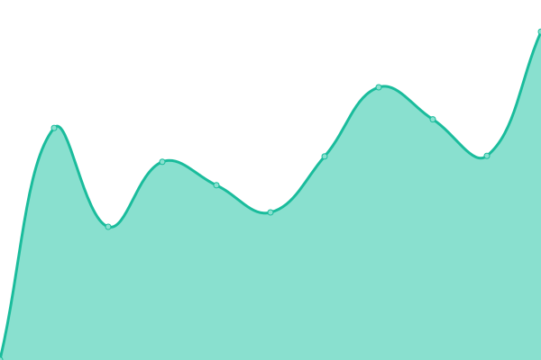
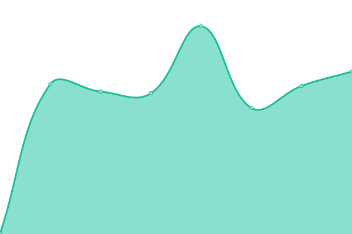
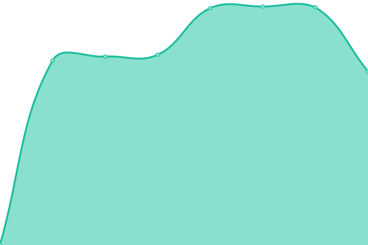
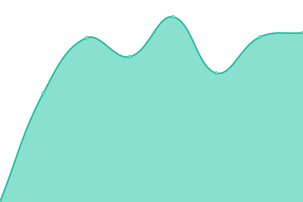
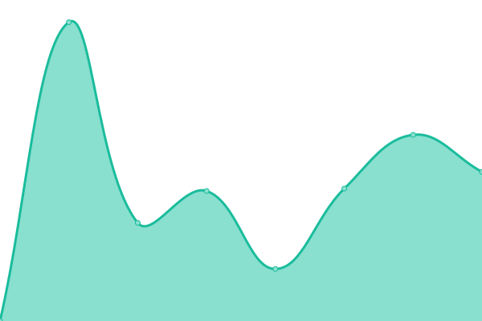
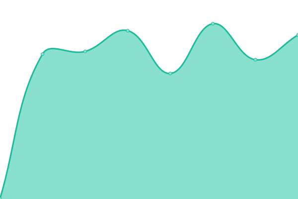
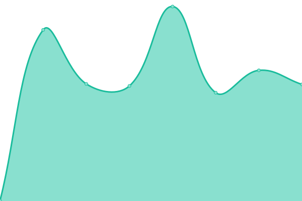
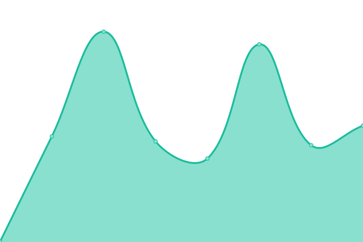
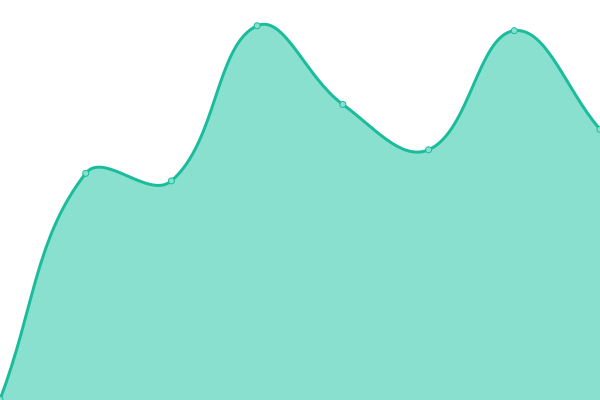

# [📈 Live Status](https://androtelema.github.io/upptime/): <!--live status--> **🟧 Partial outage**

This repository contains an uptime monitor and status page for IfI.

With [Upptime](https://upptime.js.org), you can get your own unlimited and free uptime monitor and status page, powered entirely by a GitHub repository. We use [Issues](https://github.com/upptime/upptime/issues) as incident reports, [Actions](https://github.com/androtelema/upptime/actions) as uptime monitors, and [Pages](https://upptime.github.io/upptime) for the status page.

<!--start: status pages-->
<!-- This summary is generated by Upptime (https://github.com/upptime/upptime) -->
<!-- Do not edit this manually, your changes will be overwritten -->
<!-- prettier-ignore -->
| URL | Status | History | Response Time | Uptime |
| --- | ------ | ------- | ------------- | ------ |
|  [GCMS - www.uni-goettingen.de](https://www.uni-goettingen.de) | 🟩 Up | [gcms-www-uni-goettingen-de.yml](https://github.com/androtelema/upptime/commits/HEAD/history/gcms-www-uni-goettingen-de.yml) | 

 1738ms
     
 | 

<a href="https://androtelema.github.io/upptime/history/gcms-www-uni-goettingen-de">100.00%</a>
    

|  [Yourls Link-Shortener - cs.ugoe.de](http://cs.ugoe.de) | 🟩 Up | [yourls-link-shortener-cs-ugoe-de.yml](https://github.com/androtelema/upptime/commits/HEAD/history/yourls-link-shortener-cs-ugoe-de.yml) | 

 1286ms
     
 | 

<a href="https://androtelema.github.io/upptime/history/yourls-link-shortener-cs-ugoe-de">100.00%</a>
    

|  [Stud.IP - studip.uni-goettingen.de](https://studip.uni-goettingen.de/) | 🟩 Up | [stud-ip-studip-uni-goettingen-de.yml](https://github.com/androtelema/upptime/commits/HEAD/history/stud-ip-studip-uni-goettingen-de.yml) | 

 2223ms
     
 | 

<a href="https://androtelema.github.io/upptime/history/stud-ip-studip-uni-goettingen-de">100.00%</a>
    

|  [Bewerberportal - app2.informatik.uni-goettingen.de](https://app2.informatik.uni-goettingen.de/) | 🟥 Down | [bewerberportal-app2-informatik-uni-goettingen-de.yml](https://github.com/androtelema/upptime/commits/HEAD/history/bewerberportal-app2-informatik-uni-goettingen-de.yml) | 

 0ms
     
 | 

<a href="https://androtelema.github.io/upptime/history/bewerberportal-app2-informatik-uni-goettingen-de">0.00%</a>
    

|  [Intra-Wiki (Staff only) - intra.informatik.uni-goettingen.de](https://intra.informatik.uni-goettingen.de/wiki/index.php/Main_Page) | 🟩 Up | [intra-wiki-staff-only-intra-informatik-uni-goettingen-de.yml](https://github.com/androtelema/upptime/commits/HEAD/history/intra-wiki-staff-only-intra-informatik-uni-goettingen-de.yml) | 

 4186ms
     
 | 

<a href="https://androtelema.github.io/upptime/history/intra-wiki-staff-only-intra-informatik-uni-goettingen-de">100.00%</a>
    

|  [Doc-Wiki (Public) - doc.informatik.uni-goettingen.de](https://doc.informatik.uni-goettingen.de/wiki/index.php/Hauptseite) | 🟩 Up | [doc-wiki-public-doc-informatik-uni-goettingen-de.yml](https://github.com/androtelema/upptime/commits/HEAD/history/doc-wiki-public-doc-informatik-uni-goettingen-de.yml) | 

 1169ms
     
 | 

<a href="https://androtelema.github.io/upptime/history/doc-wiki-public-doc-informatik-uni-goettingen-de">100.00%</a>
    

|  [User Homepages - user.informatik.uni-goettingen.de](https://user.informatik.uni-goettingen.de/~atmg/) | 🟩 Up | [user-homepages-user-informatik-uni-goettingen-de.yml](https://github.com/androtelema/upptime/commits/HEAD/history/user-homepages-user-informatik-uni-goettingen-de.yml) | 

 631ms
     
 | 

<a href="https://androtelema.github.io/upptime/history/user-homepages-user-informatik-uni-goettingen-de">100.00%</a>
    

|  [Group - dbis - www.dbis.informatik.uni-goettingen.de](https://www.dbis.informatik.uni-goettingen.de) | 🟩 Up | [group-dbis-www-dbis-informatik-uni-goettingen-de.yml](https://github.com/androtelema/upptime/commits/HEAD/history/group-dbis-www-dbis-informatik-uni-goettingen-de.yml) | 

 635ms
     
 | 

<a href="https://androtelema.github.io/upptime/history/group-dbis-www-dbis-informatik-uni-goettingen-de">100.00%</a>
    

|  [Group - swe - www.swe.informatik.uni-goettingen.de](https://www.swe.informatik.uni-goettingen.de) | 🟩 Up | [group-swe-www-swe-informatik-uni-goettingen-de.yml](https://github.com/androtelema/upptime/commits/HEAD/history/group-swe-www-swe-informatik-uni-goettingen-de.yml) | 

 781ms
     
 | 

<a href="https://androtelema.github.io/upptime/history/group-swe-www-swe-informatik-uni-goettingen-de">100.00%</a>
    

<!--end: status pages-->

[**Visit our status website →**](https://androtelema.github.io/upptime)

## 📄 License

- Powered by: [Upptime](https://github.com/upptime/upptime)
- Code: [MIT](./LICENSE) © [Upptime](https://upptime.js.org)
- Data in the `./history` directory: [Open Database License](https://opendatacommons.org/licenses/odbl/1-0/)
